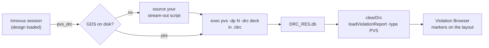

<div align="center">

# pvs_from_innovus

**Run Cadence PVS signoff DRC/LVS without leaving your Innovus session — and get the violations back in the Violation Browser.**

[](LICENSE)
[](https://www.tcl-lang.org/)
[](https://www.cadence.com/)
[](https://github.com/korotaevyua/pvs_from_innovus/actions/workflows/tcl-syntax.yml)

</div>

---

The usual signoff loop is a context switch: leave the place-and-route session, stream out a merged GDS, run PVS in a terminal, then squint at a text report and try to map coordinates back onto the floorplan.

This is a small Tcl layer that collapses that loop into one command typed at the Innovus prompt. It streams out the layout if it is not there yet, runs standalone PVS, and loads the resulting database straight into the Innovus **Violation Browser**, so every marker is clickable on the design you already have open.

```tcl
innovus> source pvs.tcl
innovus> pvs_drc -rules /pdk/pvs/drc_signoff.rul -cpus 32
```

## How it works



Everything runs in a dedicated run directory so PVS output never litters your implementation directory, and the whole transcript is tee'd to a log file next to the results.

## Requirements

| | |
|---|---|
| **Cadence Innovus** | any release with `loadViolationReport -type PVS` (17.1 and later) |
| **Cadence PVS** | `pvs` must be on `PATH` in the shell that launched Innovus |
| **Rule deck** | a PVS DRC/LVS deck from your PDK |
| **Tcl** | 8.4+, i.e. whatever your Innovus ships with — no packages required |

> Licenses for both tools are your own. This project only automates the calls between them.

## Install

Clone it anywhere your flow can reach:

```bash
git clone https://github.com/korotaevyua/pvs_from_innovus.git
```

Then source it once per session — interactively, from your `.innovusrc`, or from your flow scripts:

```tcl
source /path/to/pvs_from_innovus/pvs.tcl
```

You should see:

```
-- [PVS] pvs_from_innovus 1.1.0 ready -- type 'pvs_help' for usage
```

## Usage

### DRC

```tcl
# simplest form: the deck knows the layout and the top cell
pvs_drc -rules /pdk/pvs/drc_signoff.rul

# stream the merged GDS out first if it is missing, and use 32 cores
pvs_drc -rules /pdk/pvs/drc_signoff.rul \
        -gds    ./gds/top_merged.gds \
        -stream ./scripts/stream_out.tcl \
        -cpus   32 \
        -dir    reports/pvs_drc

# see the exact command line without running anything
pvs_drc -rules /pdk/pvs/drc_signoff.rul -dryrun
```

| Option | Default | Meaning |
|---|---|---|
| `-rules <path>` | *required* | rule deck passed to `pvs -drc` |
| `-gds <path>` | — | layout the deck expects; when it is missing, `-stream` is run |
| `-stream <path>` | — | Tcl script that produces that layout (your `streamOut` wrapper) |
| `-top <cell>` | — | appended as `-top_cell`; omit and the deck decides |
| `-cpus <n>` | `8` | value for `pvs -dp` |
| `-dir <path>` | `drc` | run directory, created if needed |
| `-db <name>` | `DRC_RES.db` | result database to load; any `*.db` is used as a fallback |
| `-log <name>` | `pvs_drc.log` | transcript file inside the run directory |
| `-extra {…}` | — | switches appended verbatim to the `pvs` command line |
| `-noload` | off | run PVS but do not touch the GUI |
| `-dryrun` | off | print the command and stop |

### LVS

```tcl
pvs_lvs -rules /pdk/pvs/lvs.rul -cdl ./netlist/top.cdl -cpus 16
```

Same options as above, plus `-cdl <netlist>` (passed as `-source_cdl`), and the run directory defaults to `lvs`. LVS switch names drift between PVS releases and foundry kits, so `pvs_lvs` only builds the ones it is sure of — add the rest with `-extra`.

### Anything else

`pvs_run` is the escape hatch: it handles the run directory, logging and PATH check, and passes your switches through untouched.

```tcl
pvs_run -dir reports/antenna -- -dp 16 -drc /pdk/pvs/antenna.rul -verbose
```

### Defaults

Typing the same paths every session gets old. Set them once:

```tcl
set ::pvs::defaults(rules)   /pdk/tsmcN7/pvs/drc_signoff.rul
set ::pvs::defaults(stream)  ./scripts/stream_out.tcl
set ::pvs::defaults(cpus)    32
set ::pvs::defaults(drc_dir) reports/pvs_drc
```

Put that in a `pvs_defaults.tcl` next to `pvs.tcl` and it is sourced automatically. [`examples/pvs_defaults.tcl`](examples/pvs_defaults.tcl) is a ready-made template, and [`examples/stream_out.tcl`](examples/stream_out.tcl) shows the kind of script `-stream` expects.

## Repository layout

```
pvs.tcl                 entry point — source this
tcl/pvs_common.tcl      option parsing, PATH checks, run dirs, report loading
tcl/pvs_drc.tcl         pvs_drc
tcl/pvs_lvs.tcl         pvs_lvs
innovus_drc.tcl         compatibility shim for the original one-proc version
examples/               defaults template and a stream-out example
```

## Troubleshooting

<details>
<summary><b><code>'pvs' was not found in PATH</code></b></summary>

Innovus inherits the environment of the shell it was launched from. Source your PVS setup *before* starting Innovus, or set `env(PATH)` inside the session and try again.
</details>

<details>
<summary><b>The run finishes but no markers appear</b></summary>

Check the run directory: `loadViolationReport` needs the PVS result database (`DRC_RES.db` by default). If your deck names it differently, pass `-db <name>`. If PVS itself failed, the reason is in `pvs_drc.log` in the same directory.
</details>

<details>
<summary><b>Violations load but the browser does not open</b></summary>

You are in a non-GUI session. The markers are loaded anyway — run `win ; violationBrowser` once the GUI is up.
</details>

<details>
<summary><b>PVS rejects a switch</b></summary>

Decks and PVS releases differ. `pvs_drc` only ever passes `-dp` and `-drc` on its own; everything else comes from you via `-top`, `-extra`, or `pvs_run`.
</details>

## Contributing

Issues and pull requests are welcome — see [CONTRIBUTING.md](CONTRIBUTING.md). Flow quirks from other PDKs and PVS releases are especially useful.

## License

[MIT](LICENSE) © Yuri Korotaev

*Not affiliated with or endorsed by Cadence Design Systems. Innovus and PVS are trademarks of their respective owner; you need your own licenses to use them.*
